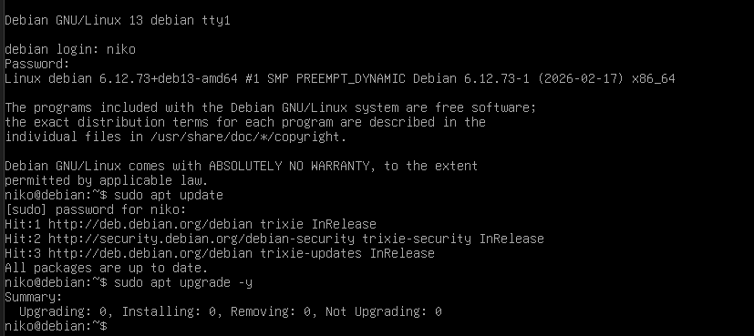
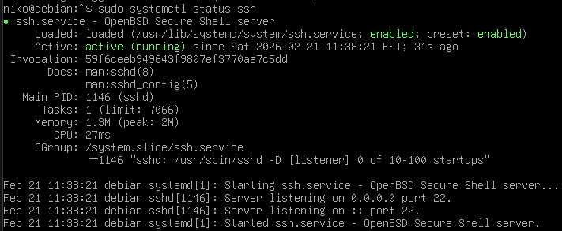
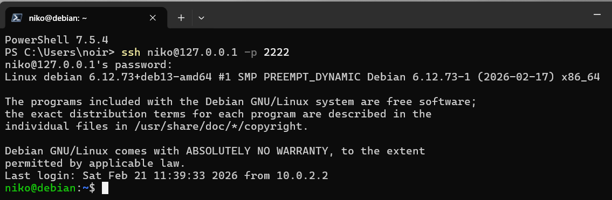
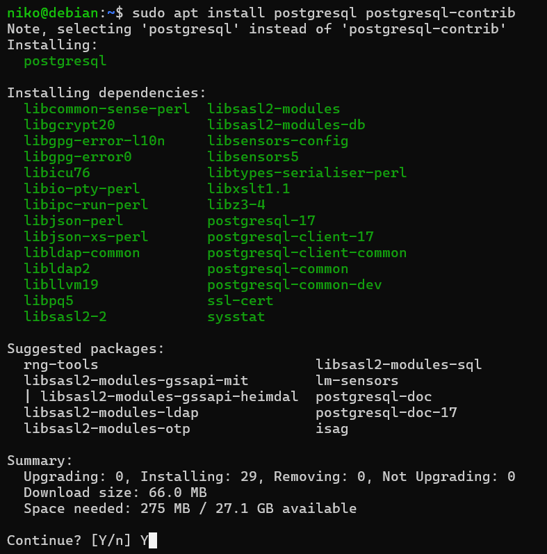

# Лабораторнапя работа №1 "Базовая настройка PostgreSQL на Debian"

Цель работы: Настроить окружение, установить PostgreSQL в Debian, освоить базовые приёмы
администрирования системы и СУБД.

## Ход работы:
- ### Подготовка среды
Установил на виртуальной машине VirtualBox Debian 13. Произвел начальную настройку системы и создал пользователя с добавление его в группу `sudo`.

Обновил систему с помощью команд `sudo apt update` и `sudo apt upgrade`.

- `sudo apt update` - проверка на новые версии;
- `udo apt upgrade` - установка обновлений.



Установил `openssh-server` для подключения к виртуалке с помощью ssh из терминала локальной машины:
```
sudo apt install openssh-server
```


И настроил проброс портов через настройки виртульной машины:


Подключение к виртуальной машине из терминала Windows:



- ### Установка PostgreSQL
Установил последную версию PostgreSQL:
```
sudo apt install postgresql postgresql-contrib
```
- `postgresql` - сам сервер PostgreSQL
- `postgresql-contrib` - набор модулей и утилит для работы c PostgreSQL



